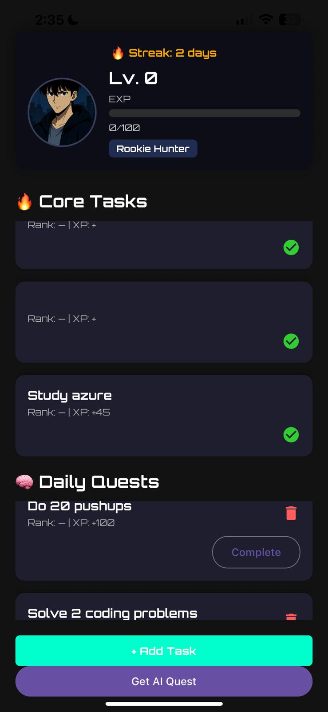

---

## 🗡️ Solo-Leveling Task App

This is a full-stack, Solo Leveling–inspired productivity app where users complete daily quests and core tasks to gain XP, level up, and evolve their rank — just like a Hunter.

Built with **React Native (Expo)** for the mobile frontend and **Flask** for the backend, with **LangChain + Ollama** handling AI quest generation.

---
## 📸 App Preview


---
### ✨ Features

* ✅ **Core Tasks** — Set tasks like “Workout” or “Study” to do daily
* 🧠 **AI-Generated Quests** — Get dynamic daily quests based on your goals and streak
* 🔥 **Streak Tracking** — Earn rewards and messages as you stay consistent
* 📈 **XP + Levels** — Complete quests to gain XP and rank up from *Rookie Hunter* to *Shadow Monarch*
* 🗓️ **Daily Reset System** — Core task completions reset each day
* 🧠 **LangChain-powered AI** — Suggests personalized tasks using Mistral via Ollama
* 🛡️ **User-Based Task Storage** — Each user has their own saved tasks using headers

---

### 📱 Tech Stack

| Layer     | Technology                             |
| --------- | -------------------------------------- |
| Frontend  | React Native (Expo)                    |
| Backend   | Flask (Python)                         |
| AI Engine | LangChain + Ollama                     |
| Storage   | JSON-based local files                 |
| Icons     | react-native-vector-icons / Expo Icons |

---

### 📦 Project Structure

```
solo-leveling-task-app/
├── backend/
│   ├── app.py
│   ├── quest_agent.py
│   ├── quest_storage.py
│   ├── core_tasks.py
│   ├── core_task_utils.py
│   ├── user_tasks/           # Per-user core task storage
│   └── ...
├── mobile/
│   ├── App.js
│   ├── screens/
│   │   └── HomeScreen.js
│   ├── components/
│   │   └── QuestCard.js
│   └── ...
└── .gitignore
```

---

### 🚀 Getting Started

#### 📦 1. Clone the repo

```bash
git clone https://github.com/your-username/solo-leveling-task-app.git
cd solo-leveling-task-app
```

---

#### 🧱 2. Backend (Flask)

```bash
cd backend
python -m venv solo
source solo/bin/activate  # or solo\Scripts\activate on Windows

pip install -r requirements.txt
python app.py
```

> Make sure Ollama is installed and running locally.

---

#### 📱 3. Mobile (React Native)

```bash
cd mobile
npm install
npx expo start
```

> Use Expo Go or an emulator to run the app.

---

### 🔐 .env & Notes

* The app uses **Ollama** locally, so no OpenAI key is required.
* Tasks are stored in JSON files under `user_tasks/`.
* Users are identified via a custom header: `X-User-ID`.

---

### 🧪 Coming Soon

* Avatar customization 👤
* Weekly Calendar View 📅
* Push Notifications + Reminders ⏰
